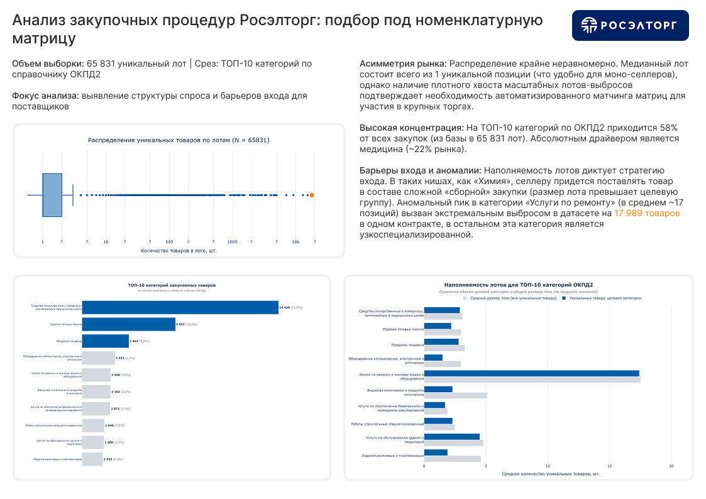

# 📊 Разведочный анализ датасетов (RTL Hack)

Проект разработан в рамках хакатона **RTL Hack (Росэлторг Университет)**. Основная цель — создание сервиса для «умного» подбора тендеров, максимально соответствующих номенклатурной матрице поставщика.

## 🎯 Моя роль в проекте
Я выступала в роли **Data Analyst**. Моей ключевой задачей было проведение глубокого разведочного анализа данных (EDA) для подготовки базы под обучение ML-модели. Анализ позволил определить структуру рынка, выявить аномалии и сформировать правила фильтрации, которые легли в основу логики сопоставления товаров.

## 📈 Аналитический дашборд

> 🔗 **[Скачать отчет в PDF](assets/roseltorg_analysis_report.pdf)**

## 🔍 Ключевые инсайты анализа
На основе исследования выборки из **65 831 уникального лота** были сделаны следующие выводы:

* **Асимметрия и порог входа:** Рынок характеризуется экстремальной неравномерностью. Медианный лот содержит всего **1 уникальную позицию** (удобно для малых поставщиков), однако наличие плотного хвоста масштабных лотов-выбросов подтверждает необходимость автоматизированного матчинга.
* **Концентрация спроса:** На ТОП-10 категорий по ОКПД2 приходится **58% всех закупок**. Абсолютным драйвером является медицина (~22% рынка). Ядро рекомендательной системы должно тестироваться в первую очередь именно на медицинских справочниках.
* **Сложность входа («Сборные лоты»):** В таких нишах, как «Химия» и «Электроника», средний размер лота значительно превышает число товаров целевой категории. Это указывает на высокую долю комплексных закупок, требующих от селлера широкой матрицы.
* **Выявление аномалий:** Зафиксированный пик в «Услугах по ремонту» (в среднем ~17 позиций) объясняется наличием в датасете единичного гигантского контракта на **17 989 товаров**, в то время как типичные закупки в этой нише являются узкоспециализированными.

## 🏆 Результаты
В ходе хакатона была реализована **каскадная модель сопоставления**, которая позволила эффективно связывать сложные номенклатурные позиции с параметрами лотов. С данным решением команда успешно **вышла в финал** интенсива.

## 🛠 Технологический стек
* **Язык:** Python
* **Библиотеки:** Pandas, Plotly (Graph Objects)
* **Методология:** Разведочный анализ данных (EDA), фильтрация аномалий, работа со справочниками ОКПД2.

## 👤 Автор
**Валерия** — Data Analyst, студентка 3 курса НИТУ МИСИС (направление «Информатика и вычислительная техника»).
* **GitHub:** [valerialosk](https://github.com/valerialosk)
* **Telegram:** [@Valeria_losk](https://t.me/Valeria_losk)
